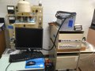

Setaram TAG 24-24 Simultaneous Digital Thermoanalyzer (Setaram Inc., France)

Measurement modes: TG alone measurements, DTA alone measurements, DSC alone measurements, simultaneous TG-DTA/DSC measurements.

* Temperature range: −150 C – 2400 C.
* Resolution: 1 uW (DSC) and 0.4 uW (DTA).
* Detection limit of TG balance: 1 ug.
* Working atmosphere: vacuum, inert and reducing atmospheres.
* TG/DTA rods: a cryostat DTA rod down to −150 C, a DTA rod up to 1600 C (Pt-PtRh 10 %), a TG rod up to 1600 C (Pt-PtRh 10 %), a DTA rod up to 1750 C (PtRh 6 − 30 %), and a DTA rod up to 2400 C (W-5 %Rh / W-20 %Rh).
* TG crucibles: quartz, alumina, platinum, graphite, and tungsten.
* DTA crucibles: quartz, alumina, platinum, graphite, and tungsten.
* Determining transition temperature (glass transition temperature, crystallization tem- perature, and melting temperature), enthalpy, specific heat capacity, phase diagram, etc.
