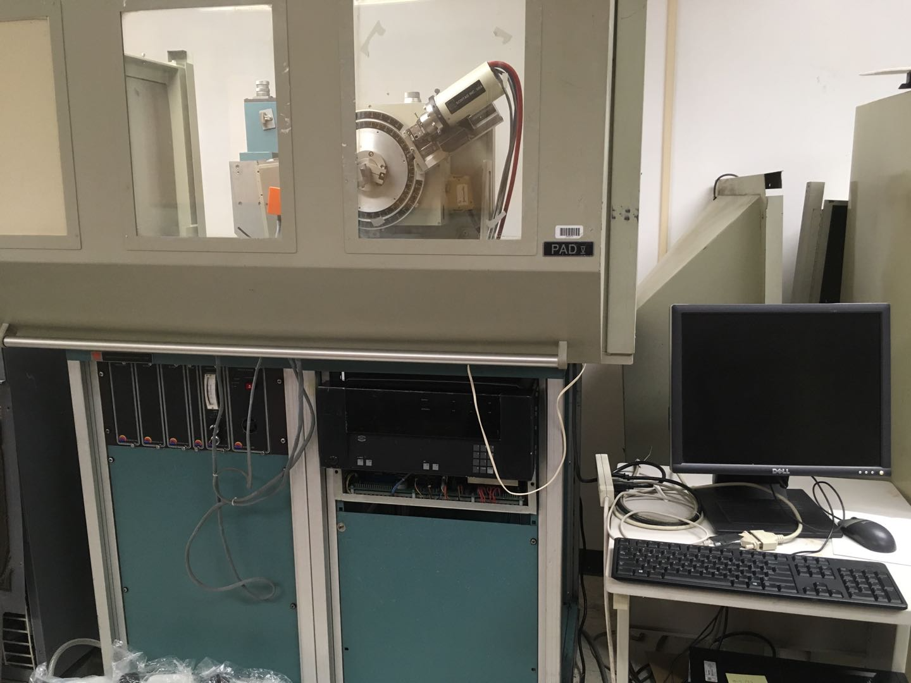

Scintag PAD-V high precision automated X-ray diffractometer (Scintag Inc., USA).

Cu-Kα X-ray radiation (λ = 1.54184 A) with Ni filter.
  * Output: up to 2,000 Watts.
  * Voltage and current: 45 kV and 40 mA (experts), 40 kV and 30 mA (novices).
  * Vertically mounted scanning 2θ range: 0.8 – 160.
  * Scanning step (2θ) (resolution): 0.001.
  * Goniometer: 150 − 275 mm radius.
  * Controlled by Diffraction Management System (DMS) software including automatic data analysis software packages.
  * Sample holders: an air sensitive sample holder, a heating stage (−30 C – 100 C)
  * Standard Reference Materials (SRM): Si (NIST SRM 640b), LaB6 (NIST SRM 660c), quartz stones, and Si polycrystals.
  * General Structure Analysis System (GASA) kits.
  * Carrying out phase identification, phase quantification, percent (%) crystallinity, crystallite size and strain, lattice parameter refinement, Rietveld refinement, crystallographic structure, etc.

---

Philips X’Pert X-ray Diffractometer (Philips, USA)

(coming)

Cu-Kα X-ray radiation (λ = 1.54184 A) with Ni filter
  * Output: up to 3,000 Watts
  * Detectors: sealed proportional counter

---

Rigaku MiniFlex desktop X-ray diffractometer (Rigaku)

(magnager)

* Voltage: 30 kV
* current: 15 mA
* step width: 0.02 degree
* 2 theta scan range: 3 - 120 degree  
